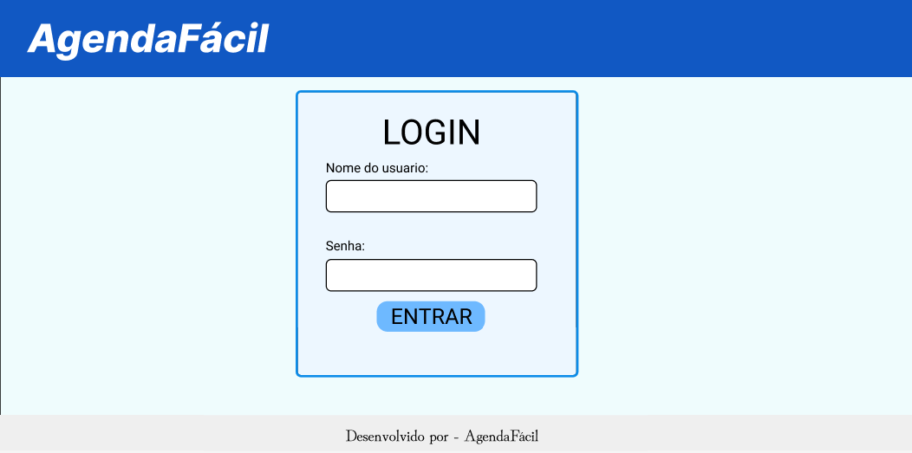
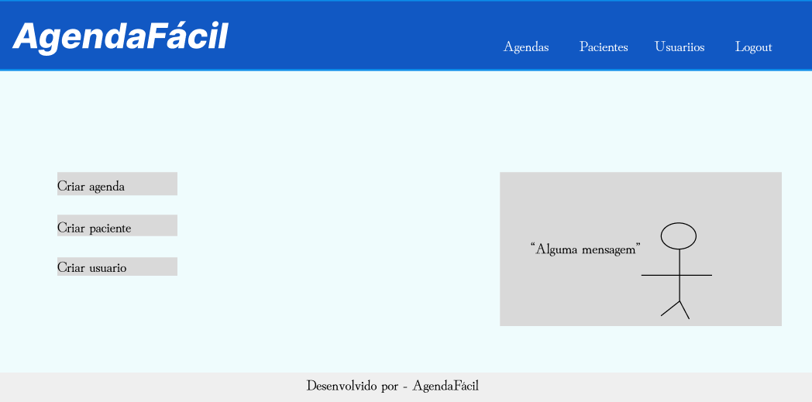
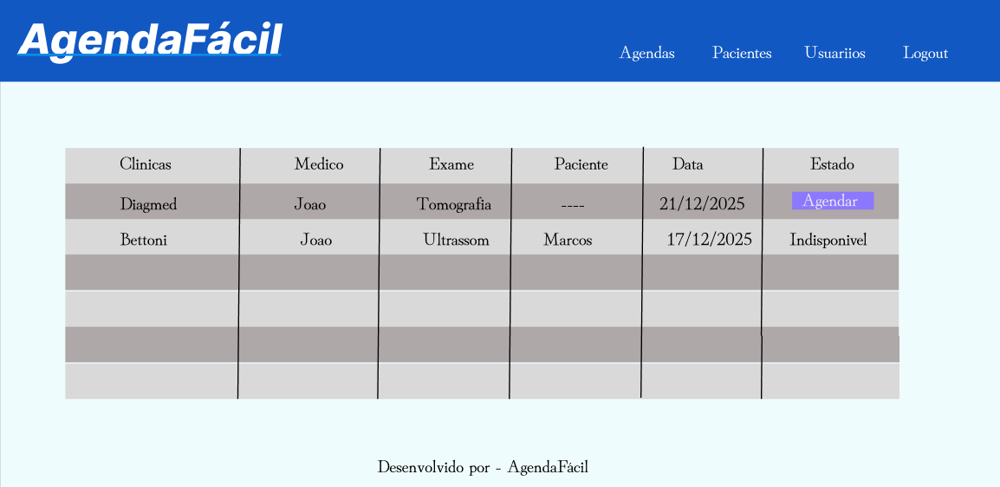
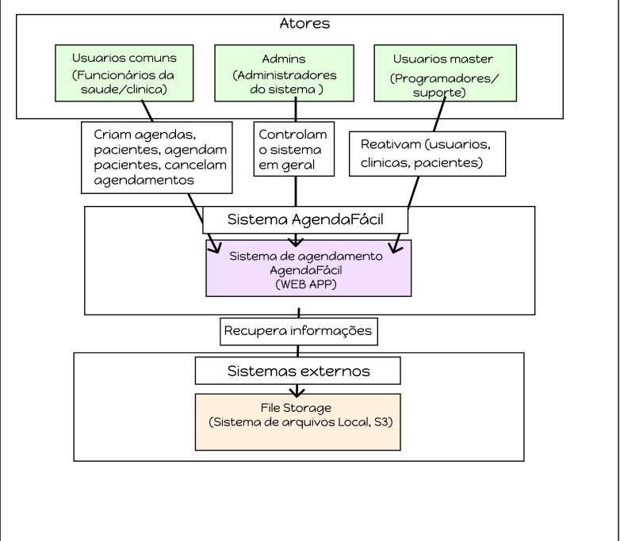
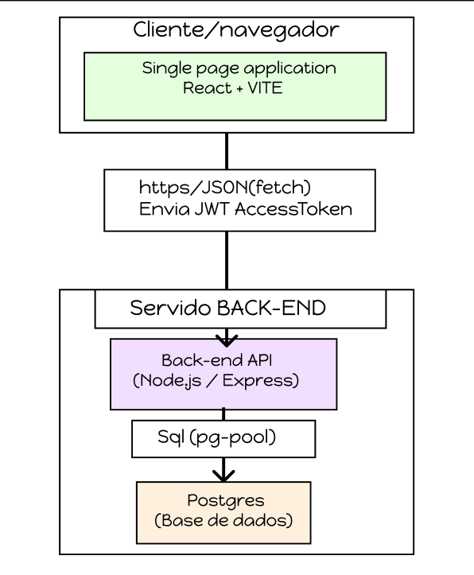
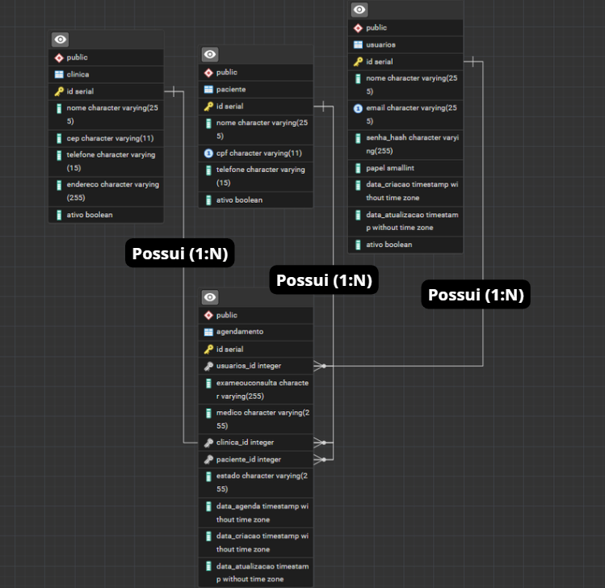
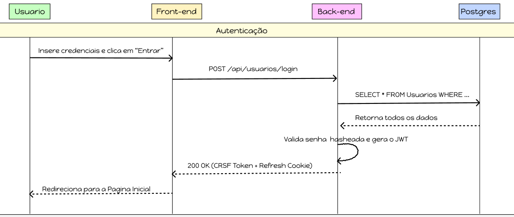
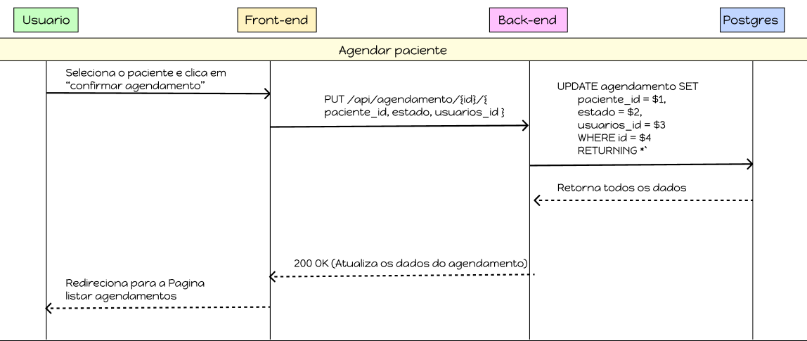

# AgendaFácil - Sistema de agendamento
## 1) Problema  
- Todos os dias, pessoas sofrem pelo atraso no agendamento de exames e consultas pelo SUS, onde algumas demoram dias, meses e até anos para serem agendadas. 
- Os sistemas são falhos e de dificil entendimento
- Com um sistema interativo, e com profissionais treinados, estas filas poderiam ser diminuidas ou até mesmo zeradas! 
- Objetivo Inicial: Reduzir as filas do SUS, e facilitar o entendimento de profissionais da Saúde.
## 2) Atores e Decisores (quem usa / quem decide)
- Atores: Funcionários da saúde e clinicas
- Decisores/Apoiadores: Admins e Usuarios Master
## 3) Casos de uso (de forma simples) 
- Todos: [ações comuns, ex.: Logar/des  logar; Manter dados cadastrais]
- Funcionario da saúde: Manter (inserir, mostrar, editar, remover) todos os agendamentos e pacientes.
- Clinica: Manter (inserir, editar, remover) todas as agendas disponiveis.
- Admin: Manter (inserir, editar, mostrar, remover) todas as vagas, agendamentos, pacientes e usuários.
## 4) Limites e suposições
- Limites: entrega final até o fim da disciplina (ex.: 2025-11-30); rodar no
navegador; sem serviços pagos.
- Suposições: internet no laboratório; navegador atualizado; acesso ao GitHub; 10
min para teste rápido.
- Plano B: sem internet → rodar local e salvar em arquivo/LocalStorage; sem tempo do
professor → testar com 3 colegas. -->
## 5) Hipóteses + validação

H-Valor: Se o funcionário tem mais facilidade de manusear o sistema, então a fila do SUS anda mais rápido.
Validação: Envia para 5 uniades de saude e testa se os funcionários conseguem manusear apenas utilizando o manual de uso.
H-Viabilidade: Com HTML/CSS/JS + armazenamento local. Cadastrar exames/consultas, e agendar pacientes, leva até 5s.
Validação (viabilidade): medir 40 ações; meta: pelo menos 36 das 40 ações em 2s ou menos
## 6) Fluxo principal e primeira fatia

**Fluxo principal (curto):**
1) Funcionario da saúde faz login → 
2) Procura o exame/consulta que deseja → 
3) Agenda o paciente →
4) Mostra a confirmação
**Primeira fatia vertical (escopo mínimo):**
Inclui: 3 telas (por tipo de usuário), 3 ações por usuário, Cadastrar, editar e excluir (CRUD);
Critérios de aceite:
- Cadastro realizado com sucesso;
- Edição realizada com sucesso;
- Exclusão realizada com sucesso
## 7) Esboços de algumas telas (wireframes)
- Login.
- Botões de cadastrar (Usuario, Clinica, Paciente, Agendamento), com base nas permissões do usuario.
- Campos de listar (Usuarios, Clinicas, Pacientes, Agendamentos)
- No campo de listar agendamentos permitir agendas sem pacientes com botões "agendar"
- Permitir inativação (Usuarios, Clinicas, Pacientes, Agendamentos) com base nas permissões do usuário.





Diagrama de contexto



Diagrama de container



Diagrama ERD



Diagrama de sequencia



Diagrama de sequencia 2



## 8) Tecnologias
### 8.1 Navegador
**Navegador:** [HTML/CSS/JS | JS, BOOTSTRAP]
**Armazenamento local:**
**Hospedagem:** [GitHub Pages]
### 8.2 Front-end (servidor de aplicação, se existir)
**Front-end (servidor):** [ React + Vite ]
**Hospedagem:** [GitHub Pages]
### 8.3 Back-end (API/servidor, se existir)
**Back-end (API):** [ Node.js com Express ]
**Banco de dados:** [ Postgree]
**Hospedagem:** [ Render ]
## 9) Plano de Dados (Dia 0) — somente itens 1–3

### 9.1 Entidades
- [ Master ] — [Pode reativar (usuarios, clinicas, pacientes) excluidos e fazer todas as outras funçoes dos usuarios de nivel inferior]
- [ Admin ] — [Autoriza criação de usuários, pode excluir registros, e fazer todas as outras funçoes dos usuarios de nivel inferior]
- [Funcionario da saúde] — [Agenda pacientes, faz ou cancela agendamentos, cria pacientes ou exclui]
- [ Clinicas ] — [Cadastra clinicas, cria exames/consultas] 
### 9.2 Campos por entidade
### Usuario
| Campo           | Tipo                          | Obrigatório | Exemplo            |
|-----------------|-------------------------------|-------------|--------------------|
| id              | número                        | sim         | 1                  |
| nome            | texto                         | sim         | "Ana Souza"        |
| email           | texto                         | sim (único) | "Murilo@gmail.com" |
| senha_hash      | texto                         | sim         | "$2a$10$..."       |
| AtivoOuNao      | boolean                       | sim         | true               |
| papel           | número (0=admin, 1=funcionário da saúde, 2=Clinica, 3-Master) | sim | 0    |
| dataCriacao     | data/hora                     | sim         | 2025-08-20 14:30   |
| dataAtualizacao | data/hora                     | sim         | 2025-08-20 15:10   |
### Paciente
| Campo           | Tipo                          | Obrigatório | Exemplo            |
|-----------------|-------------------------------|-------------|--------------------|
| id              | número                        | sim         | 1                  |
| nome            | texto                         | sim         | "Ana Souza"        |
| CPF             | texto                         | sim         | "074.844.888-25"   |
| Telefone        | texto                         | sim         | "(49)99144-7768"   |
| AtivoOuNao      | boolean                       | sim         | true               |

### Clinica
| Campo           | Tipo                          | Obrigatório | Exemplo            |
|-----------------|-------------------------------|-------------|--------------------|
| id              | número                        | sim         | 1                  |
| nome            | texto                         | sim         | "Ana Souza"        |
| CEP             | texto                         | sim         | "88654-112"        |
| Telefone        | texto                         | sim         | "(49)99144-7768"   |
| Endereco        | texto                         | sim         | "Rua dos padres"   |
| AtivoOuNao      | boolean                       | sim         | true               |

### Agenda
| Campo           | Tipo               |Obrigatório  | Exemplo                   |
|-----------------|--------------------|-------------|---------------------------|
| id              | número             | sim         | 2                         |
| Usuarios_id     | número (fk)        | sim         | 1                         |
| Exame/consulta  | texto              | sim         | "Ecocardiograma"          |
| Medico          | texto              | sim         | "Afonso Abreu"            |
| Paciente_id     | numero             | nao         | 1                         |
| estado          | texto              | sim         | 'Disponivel' \ 'Utilizada'|
| dataCriacao     | data/hora          | sim         | 2025-08-20 14:35          |
| dataAtualizacao | data/hora          | sim         | 2025-08-20 14:50          |
### 9.3 Relações entre entidades
- Uma Clinica tem muitos exames/consultas. (1→N) 
- Um exame/consulta pertence a muitas clinicas. (1→N)
- Um funcionario da saúde possui muitos agendamentos. (N→1) 

### 9.4 Modelagem do banco de dados no POSTGRES

CREATE TABLE IF NOT EXISTS Usuarios (
    id                SERIAL       NOT NULL PRIMARY KEY,
    nome              VARCHAR(255) NOT NULL,
    email             VARCHAR(255) NOT NULL UNIQUE,
    senha_hash        VARCHAR(255) NOT NULL,
    papel             SMALLINT     NOT NULL CHECK (papel IN (0,1,2,3)),  -- 0=admin, 1=funcionário da saúde, 2=Clinica, 3 master
    data_criacao      TIMESTAMP    DEFAULT now(),
    data_atualizacao  TIMESTAMP    DEFAULT now(),
    Ativo             BOOLEAN      DEFAULT TRUE
);

CREATE TABLE IF NOT EXISTS Paciente(
    id                SERIAL       NOT NULL PRIMARY KEY,
    Nome              VARCHAR(255) NOT NULL,	
    CPF               VARCHAR(11)  NOT NULL UNIQUE,
    Telefone          VARCHAR(15)  NOT NULL,
 	Ativo             BOOLEAN      DEFAULT TRUE
);

CREATE TABLE IF NOT EXISTS Clinica(
    id                SERIAL       NOT NULL PRIMARY KEY,
    Nome              VARCHAR(255) NOT NULL,	
    CEP               VARCHAR(11)  NOT NULL,
    Telefone          VARCHAR(15)  NOT NULL,
    Endereco          VARCHAR(255) NOT NULL,
    Ativo             BOOLEAN      DEFAULT TRUE
);

CREATE TABLE IF NOT EXISTS Agendamento(
    id                SERIAL       NOT NULL PRIMARY KEY,
    Usuarios_id       INTEGER      NOT NULL REFERENCES Usuarios(id),
    ExameOuConsulta   VARCHAR(255) NOT NULL,
    Medico            VARCHAR(255) NOT NULL,
    Clinica_id        INTEGER      NOT NULL REFERENCES Clinica(id),
    Paciente_id       INTEGER      REFERENCES Paciente(id),	
    estado            VARCHAR(255) NOT NULL CHECK (estado IN ('d','u')), -- d-Disponivel, u-Utilizado
    data_agenda       TIMESTAMP    NOT NULL    ,
    data_criacao      TIMESTAMP    DEFAULT now(),
    data_atualizacao  TIMESTAMP    DEFAULT now()
);

## 🔧 Como rodar localmente (passo a passo)

### 1) Pré-requisitos
- **Node.js** instalado (versão LTS recomendada sendo versão 18 ou superior)  
- **PostgreSQL** rodando localmente (versão 14 ou superior)
- **Express.js** instalado

### 2) Criar arquivo `.env` na raiz do projeto e ajustar as variáveis
```env
#PORTA DO SERVIDOR DO EXPRESS
PORT=3000

# CONFIGURAÇÃO POSTGRES
DB_HOST=localhost
DB_PORT=5432
DB_USER=postgres
DB_PASSWORD=senha
DB_DATABASE=db_agendamentos
PG_DATABASE_ADMIN=postgres
DB_DATABASE_ADMIN_PASSWORD=senha

# CAMINHO PARA O SQL DO BANCO EM POSTGRES
DB_DATABASE_FILE_PATH=./src/database/banco.sql

# CONFIGURAÇÃO JWT
JWT_ACCESS_SECRET=meu-segredo-jwt-access
JWT_REFRESH_SECRET=meu-segredo-jwt-refresh
JWT_ACCESS_EXPIRES=15m
JWT_REFRESH_EXPIRES=7d
```

### 3) Instalar dependências 
```bash
npm install
```

### 4) Criar o banco de dados
- Ajuste o caminho para o arquivo do banco de dados no .env.  
- Ajuste usuário/senha/porta conforme o seu Postgres.
- Execute o seguinte script para criar e popular o banco de dados e depois para iniciar

```bash
npm run reset-database
npm run dev   # ou: node server.js / npm start (conforme seu package.json)
```

### 5) Porta Padrão
O servidor será executado por padrão na porta 3000. Você pode acessá-lo em http://localhost:3000.

### 6) Variáveis de Ambiente
O arquivo .env é necessário para configurar a conexão com o banco de dados e a porta do servidor.

| Variável        | Descrição          | Exemplo                 |
|-----------------|--------------------|-------------------------|
| PORT              | A porta em que o servidor Express irá rodar. | 3000 |
| DB_HOST      | O endereço do servidor do banco de dados.	 | localhost         |
| DB_PORT         | A porta do servidor do banco de dados.	 | 5432          |
| DB_USER        | O nome de usuário para conectar ao banco.	 | postgres          |
| DB_PASSWORD     | A senha para o usuário do banco de dados. (Deve ser alterada no .env)	 | senha          |
| DB_DATABASE | O nome do banco de dados da aplicação. | db_agendamentos         |
| DB_DATABASE_ADMIN_PASSWORD | A senha do superusuário do Postgres, usada pelo script de reset. (Deve ser alterada no .env) | senha      |
| PSQL_PATH | (Opcional) Caminho completo para o executável psql.exe no Windows, caso não esteja no PATH do sistema.	 | C:\...\psql.exe     |

### 11) Endpoints da API

## 📦 Rotas — Agendamento

| Método | Rota | Descrição / Observações |
|--------|------|---------|-------------------------|
| GET    | `api/agendamento` | Listar todos os agendamentos. |
| GET    | ` api/agendamento/:id` | Buscar agendamentos por ID. |
| POST   | `api/agendamento ` | Criar agendamento.|
| PUT    | `api/agendamento/:id` | Atualizar agendamento. |
| PATCH    | `api/agendamento/:id` | Atualizar agendamento. |

## 👤 Rotas — Usuário

| Método | Rota | Descrição / Observações |
|--------|------|---------|-------------------------|
| GET    | `api/usuarios` | Listar todos os usuarios. |
| GET    | ` api/usuarios/:id` | Buscar usuarios por ID. |
| POST   | `api/usuarios ` | Criar usuarios.|
| PUT    | `api/usuarios/:id` | Atualizar usuarios. |
| PATCH    | `api/usuarios/:id` | Atualizar usuarios. |
| PATCH    | `api/usuarios/:id/ativo` | Ativar ou Inativar usuarios. |


## 🔁 Rotas — Clinicas

| Método | Rota | Descrição / Observações |
|--------|------|---------|-------------------------|
| GET    | `api/clinica` | Listar todas as clinicas. |
| GET    | ` api/clinica/:id` | Buscar clinica por ID. |
| POST   | `api/clinica ` | Criar clinica.|
| PUT    | `api/clinica/:id` | Atualizar clinica. |
| PATCH    | `api/clinica/:id` | Atualizar clinica. |
| PATCH    | `api/clinica/:id/ativo` | Ativar ou Inativar clinica. |

## 🔁 Rotas — Pacientes

| Método | Rota | Descrição / Observações |
|--------|------|---------|-------------------------|
| GET    | `api/paciente` | Listar todos os pacientes. |
| GET    | ` api/paciente/:id` | Buscar paciente por ID. |
| POST   | `api/paciente ` | Criar paciente.|
| PUT    | `api/paciente/:id` | Atualizar paciente. |
| PATCH    | `api/paciente/:id` | Atualizar paciente. |
| PATCH    | `api/paciente/:id/ativo` | Ativar ou Inativar paciente. |
